# SK 네트웍스 Family AI 캠프 12기 2차 프로젝트

## 팀소개

### 팀 이름 : 슈퍼마리오팀

<table>
  <thead>
    <td align="center">
      <a href="">
        <br /><hr/>
        이석원
      </a><br />
    </td>
    <td align="center">
      <a href="">
        <br /><hr/>
        권성호
      </a><br />
    </td>
    <td align="center">
      <a href="">
        <br /><hr/>
        이용규
      </a><br />
    </td>
    <td align="center">
      <a href="">
        <br /><hr/>
        조성지
      </a><br />
    </td>
    <td align="center">
      <a href="">
        <br /><hr/>
        김이경
      </a><br />
    </td>
  </thead>
</table>

## 프로젝트 소개

### 🏦 프로젝트 명: 은행 고객 이탈 예측

#### 📆 개발 기간

> 2025.04.16 ~ 2025.04.17 (총 2일)

#### 📂 데이터 셋

> https://github.com/adin786/bank_churn/tree/main

- 은행 고객 이탈

#### 💵 프로젝트 배경


- 주거래은행 이탈 비율이 높아지고 있음
    - 시중은행 이탈률: **10.1%**
    - 인터넷 전문은행 이탈률: **30.7%**
    - 연령이 낮을수록 이탈 비율이 높고 장기적으로 이탈 비율이 증가할 것으로 예상됨

#### 💴 프로젝트 필요성

- 과반이 넘는 소비자가 **거래 이탈 의향**을 가지고 있음
- 따라서 고객 이탙을 막기 위한 **이탈 예측 모델**이 필요함


- 특히 최근 낮은 금리를 지원하는 **비대면 대출 갈아타기 서비스**로 인해, 비대면 플랫폼으로의 이탈 비율이 높아지고 있음
- 때문에 은행 데이터를 기반으로 고객의 이탈을 예측하는 모델은 시의성 측면에서도 적합한 주제임

## 기술스택

| 목록        | 기술                                                                                                                                                                                                                   |
| ----------- | ---------------------------------------------------------------------------------------------------------------------------------------------------------------------------------------------------------------------- |
| 언어        |                                                                                                                     |
| 데이터 분석 | ,                   |
| 시각화      |   |
| 협업        |                           |

## WBS

### 📆 프로젝트 일정정

| 내용               | 기간                |
| ------------------ | ------------------- |
| 프로젝트 주제 설정 | 25.04.17 - 25.04.18 |
| 데이터 수집        | 25.04.17 - 25.04.18 |
| 데이터 EDA         | 25.04.17 - 25.04.18 |
| 데이터 전처리      | 25.04.17 - 25.04.18 |
| 모델 선정          | 25.04.17 - 25.04.18 |
| 모델 학습 및 평가  | 25.04.17 - 25.04.18 |
| README 작성        | 25.04.17 - 25.04.18 |
| 발표 준비          | 25.04.17 - 25.04.18 |

## 주요 모델

| **번호** | **모델명**                              |
| -------- | ---------------------------------------- |
| 1        | **로지스틱 회귀** (Logistic Regression) |
| 2        | **K-최근접 이웃** (KNN)                 |
| 3        | **의사결정나무** (Decision Tree)        |
| 4        | **랜덤 포레스트** (Random Forest)       |
| 5        | **XGBoost**                             |
| 6        | **서포트 벡터 머신** (SVM)              |
| 7        | **다층 퍼셉트론** (MLPClassifier)       |
| 8        | **보팅 분류기** (Voting Classifier)     |
| 9       | **오토ML** (AutoML) |


## EDA

### 📊 데이터 로드
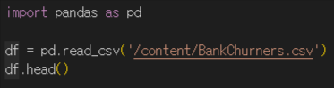
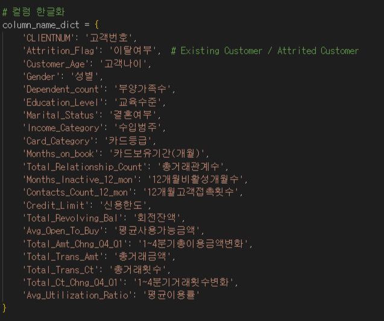


### 📊 데이터 드랍

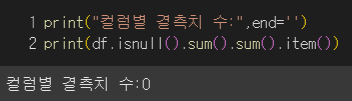

### 📊 인코딩_ 라벨 인코딩, 원 핫 인코딩

#### 데이터_구간화

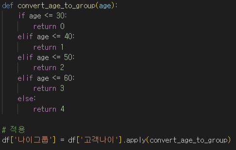
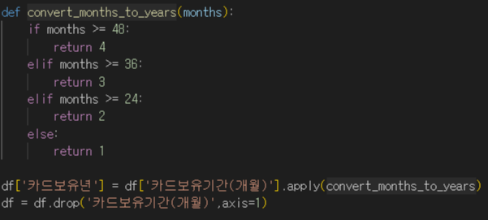
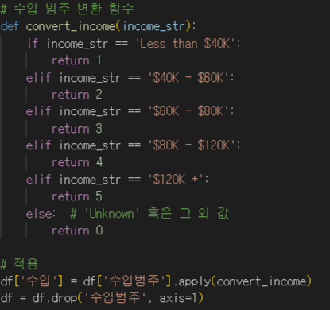
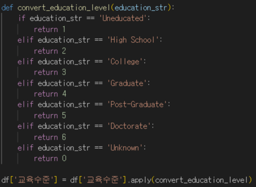

#### 원-핫 인코딩

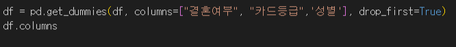

### 📊 데이터 이상치 확인 및 스케일링

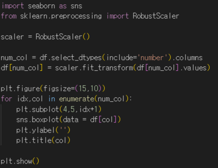

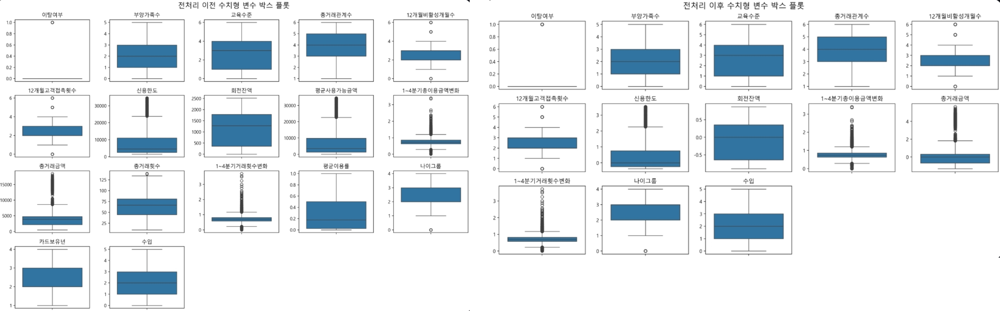

### 📊 인코딩전 히트맵 시각화

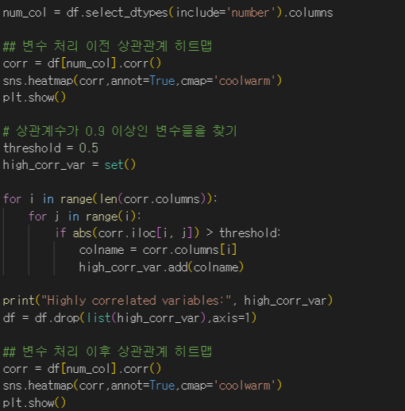

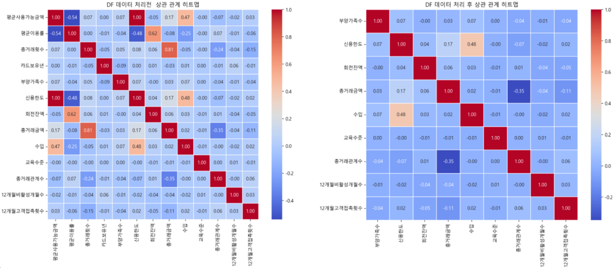

### 📊 클래스 불균형

#### SMOTE 이용 오버샘플링
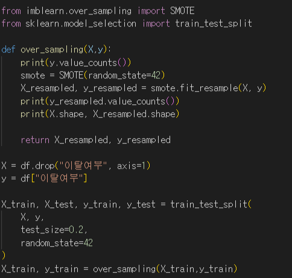

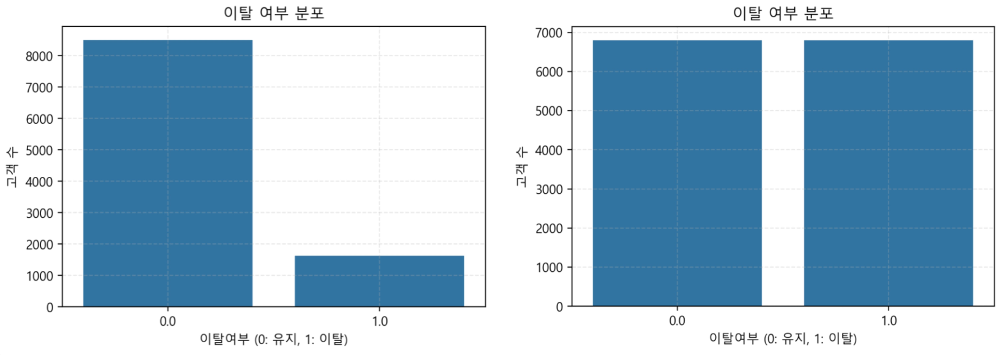


## 데이터 구성

| **컬럼명**                | **의미**                                |
| ------------------------- | --------------------------------------- |
| **이탈여부**              | 고객이 이탈했는지 여부                  |
| **부양가족수**            | 고객이 부양하는 가족 수                 |
| **교육수준**              | 고객의 교육 수준                        |
| **총거래관계수**          | 고객과 은행 간 전체 거래 항목 수        |
| **12개월비활성개월수**    | 최근 12개월 동안 비활성 기간(월) 수     |
| **12개월고객접촉횟수**    | 최근 12개월 동안 고객 접촉 횟수         |
| **신용한도**              | 고객의 신용 한도                        |
| **회전잔액**              | 회전(남은) 잔액                         |
| **1~4분기총이용금액변화** | 1~4분기 동안의 총 이용금액 변화         |
| **총거래금액**            | 총 거래 금액                            |
| **1~4분기거래횟수변화**   | 분기별 거래 횟수의 변화                 |
| **나이그룹**              | 나이 범주형 그룹                        |
| **수입**                  | 고객의 수입 수준                        |
| **결혼여부**              | 고객의 결혼 여부                        |
| **카드등급**              | 고객의 카드 등급                        |
| **성별**                  | 고객의 성별                             |

## 모델별 분석
### 🤖 기본 모델
| 모델명             |   f1(CV) |   accuracy(CV) |   precision(CV) |   roc_auc(CV) |   recall(CV) |   f1(Test) |   accuracy(Test) |   precision(Test) |   roc_auc(Test) |   recall(Test) |
|:-------------------|---------:|---------------:|----------------:|--------------:|-------------:|-----------:|-----------------:|------------------:|----------------:|---------------:|
| LogisticRegression |   0.8119 |         0.8153 |          0.8199 |        0.8946 |       0.8070 |     0.4889 |           0.7843 |            0.3943 |          0.7272 |         0.6431 |
| KNN                |   0.9002 |         0.8909 |          0.8296 |        0.9653 |       0.9840 |     0.4870 |           0.7754 |            0.3843 |          0.7306 |         0.6646 |
| DecisionTree       |   0.9198 |         0.9196 |          0.9171 |        0.9196 |       0.9228 |     0.7265 |           0.9023 |            0.6591 |          0.8646 |         0.8092 |
| RandomForest       |   0.9611 |         0.9610 |          0.9570 |        0.9922 |       0.9653 |     0.8065 |           0.9353 |            0.7756 |          0.8968 |         0.8400 |
| XGBoost            |   0.9608 |         0.9608 |          0.9595 |        0.9929 |       0.9623 |     0.8304 |           0.9427 |            0.7911 |          0.9149 |         0.8738 |
| SVC                |   0.8674 |         0.8708 |          0.8823 |        0.9399 |       0.8553 |     0.5882 |           0.8514 |            0.5296 |          0.7746 |         0.6615 |
| MLP                |   0.9400 |         0.9398 |          0.9328 |        0.9837 |       0.9476 |     0.7489 |           0.9166 |            0.7241 |          0.8595 |         0.7754 |
| VotingClassifier   |   0.9582 |         0.9580 |          0.9518 |        0.9912 |       0.9650 |     0.7798 |           0.9269 |            0.7550 |          0.8781 |         0.8062 |

---
### 🤖 튜닝 후 모델
| 모델명             |   f1(CV) |   accuracy(CV) |   precision(CV) |   roc_auc(CV) |   recall(CV) |   f1(Test) |   accuracy(Test) |   precision(Test) |   roc_auc(Test) |   recall(Test) |
|:-------------------|---------:|---------------:|----------------:|--------------:|-------------:|-----------:|-----------------:|------------------:|----------------:|---------------:|
| LogisticRegression |   0.8129 |         0.8159 |          0.8206 |        0.8940 |       0.8076 |     0.5006 |           0.7853 |            0.3993 |          0.7390 |         0.6708 |
| KNN                |   0.9151 |         0.9081 |          0.8511 |        0.9654 |       0.9894 |     0.5155 |           0.7996 |            0.4211 |          0.7450 |         0.6646 |
| DecisionTree       |   0.9086 |         0.9083 |          0.9053 |        0.9126 |       0.9120 |     0.6620 |           0.8810 |            0.6082 |          0.8184 |         0.7262 |
| RandomForest       |   0.9400 |         0.9403 |          0.9438 |        0.9850 |       0.9363 |     0.7864 |           0.9255 |            0.7277 |          0.8971 |         0.8554 |
| XGBoost            |   0.9579 |         0.9581 |          0.9600 |        0.9921 |       0.9560 |     0.8435 |           0.9467 |            0.7973 |          0.9259 |         0.8954 |
| SVC                |   0.9153 |         0.9160 |          0.9136 |        0.9690 |       0.9187 |     0.6579 |           0.8840 |            0.6243 |          0.8077 |         0.6954 |
| MLP                |   0.9400 |         0.9398 |          0.9328 |        0.9837 |       0.9476 |     0.7489 |           0.9166 |            0.7241 |          0.8595 |         0.7754 |
| VotingClassifier   |   0.9605 |         0.9601 |          0.9514 |        0.9925 |       0.9698 |     0.7838 |           0.9289 |            0.7654 |          0.8780 |         0.8031 |
---
### 🤖 AutoML
| 모델명   |   f1(CV) |   accuracy(CV) |   precision(CV) |   roc_auc(CV) |   recall(CV) |   f1(Test) |   accuracy(Test) |   precision(Test) |   roc_auc(Test) |   recall(Test) |
|:---------|---------:|---------------:|----------------:|--------------:|-------------:|-----------:|-----------------:|------------------:|----------------:|---------------:|
| AutoML   |   0.9976 |         0.9976 |          0.9984 |        0.9999 |       0.9967 |     0.8535 |           0.9502 |            0.8322 |          0.9812 |         0.8759 |

### 모델별 성능비교 그래프


## 최종학습 모델 선정

```
튜닝 모델 성능 확인 결과, XGBoost가 가장 높았으나
더 개선될 여지가 있는지 확인하기 위해
AutoML 모델을 확인한 결과 성능이 더 좋았음
```

## 은행 이탈 예측 대시보드


## 인사이트 및 결론

### 예측 결과 인사이트
- 미혼일수록 이탈 비율이 높으므로 1인 예적금 상품 등 싱글을 대상으로 한 상품을 제공해야 함
- 여자일수록 이탈 비율이 높으므로 여성을 타겟한 마케팅이 필요함
- 회전잔액이 없을수록 이탈 비율이 높으므로 고객들의 은행거래금액을 높일 수 있는 혜택이나 인센티브를 제공해야 함

### 🏢 은행 입장에서의 이점

- 이탈 위험이 높은 고객을 미리 파악해 타겟 맞춤형 프로모션을 제공할 수 있음
- 맞춤형 금융상품 추천으로 고객 충성도를 높이고 이탈을 방지할 수 있음

### 🙇‍♀️ 소비자 입장에서의 이점

- 본인의 은행 이용 패턴에 맞는 혜택을 제공받을 수 있음
- 개선된 고객 경험을 얻을 수 있음


## 회고

| 팀원         | 한 줄 회고 |
| --------------- | -------------- |
| 이석원      |어쩌다 인생 첫 팀장을 맡게 되었는데 아쉬움과 뿌듯함이 동시에 남는 2일이었습니다. 좋은 팀원분들과 함께 하게 되어 좋았습니다.|
| 권성호      |🎉 지난 이틀간 함께해 정말 행복했고 즐거웠습니다, 모두 고생 많으셨고 우리의 소중한 추억 오래도록 빛나길 바랍니다. 💖🌟|
| 이용규      |효과적인 분업을 통해 분업의 효과를 깨달았고, 작업하며 부족한 부분을 채워주신 다른 팀원들덕분에 학습효과도 가져가는것같아 뿌듯합니다.|
| 조성지      |팀 분위기가 역대급으로 좋았어용!! 수업 때 배웠던 내용들도 직접 적용해볼 수 있어서 좋았습니다~|
| 김이경      |멋진 팀원들 덕분에 많이 배워갑니다! 화목한 분위기 속에서 진행한 플젝은 역시 최고네요.😉|
